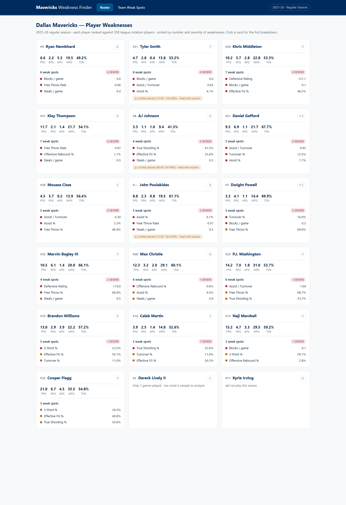

# Mavericks Weakness Finder

A functional scouting dashboard that pulls **real, current NBA data** and computes
statistical **weaknesses** for every player on the Dallas Mavericks roster.

It ranks each Maverick against a league-wide pool of rotation players, flags where
they fall into the "bad" tail of each metric, breaks their shooting down by court
zone, and rolls everything up into a team-wide view of shared soft spots.

> Data is live from the NBA Stats API via [`nba_api`](https://github.com/swar/nba_api).
> Nothing here is mocked or hard-coded, the roster, stats, and shot charts are pulled
> for the configured season (default **2025-26**) and cached locally.



---

## What it computes

For each player the engine answers: *"On which metrics is this player meaningfully
below the players they should be compared to?"*

- **Percentile ranking** against a comparison pool of league **rotation players**
  (≥ 15 MPG and ≥ 20 GP — 350 players in 2025-26).
- **Weakness score (0–100):** how far into the *bad* tail the player sits for a
  metric. `≥ 65` is flagged; tiers are **mild (65)**, **notable (72)**, **severe (85)**.
- **Position-aware comparison.** Rebounding, playmaking, steals, blocks and fouls are
  compared *within the player's position bucket* (Guard / Forward / Big), derived from
  all 30 team rosters — so a center isn't dinged for a guard-like assist rate. Shooting,
  efficiency and ball-security metrics are compared league-wide.
- **Volume guards** prevent false positives on tiny samples (e.g. 3-point % is only
  judged for players attempting ≥ 2.0 threes/game; free-throw rate needs ≥ 5 FGA/game).
- **Shot-zone weaknesses.** Field-goal % in each of the 6 court zones vs. the league
  average for that zone, flagging high-volume zones (≥ 20 attempts) where the player
  shoots ≥ 3 points below average.
- **Small-sample handling.** Players under 10 GP are not analyzed; players under
  25 GP / 12 MPG are analyzed but tagged *low-confidence*.
- **Relative strengths** (≥ 80th percentile) are surfaced too, so the profile is balanced.

### Metric catalog (14 metrics, 6 categories)

| Category | Metric | Source field | Direction | Position-relative |
|---|---|---|---|---|
| Shooting | 3-Point % | `FG3_PCT` (+`FG3A` guard) | higher better | – |
| Shooting | Free Throw % | `FT_PCT` (+`FTA` guard) | higher better | – |
| Efficiency | True Shooting % | `TS_PCT` | higher better | – |
| Efficiency | Effective FG % | `EFG_PCT` | higher better | – |
| Efficiency | Free Throw Rate | `FTA/FGA` (derived) | higher better | – |
| Ball Security | Turnover % | `TM_TOV_PCT` | lower better | – |
| Ball Security | Assist / Turnover | `AST_TO` | higher better | ✓ |
| Playmaking | Assist % | `AST_PCT` | higher better | ✓ |
| Rebounding | Defensive Rebound % | `DREB_PCT` | higher better | ✓ |
| Rebounding | Offensive Rebound % | `OREB_PCT` | higher better | ✓ |
| Defense | Defensive Rating | `DEF_RATING` | lower better | – |
| Defense | Steals / game | `STL` | higher better | ✓ |
| Defense | Blocks / game | `BLK` | higher better | ✓ |
| Defense | Fouls / game | `PF` | lower better | ✓ |

The percentile math is **scale-invariant**, so weakness scores are correct regardless
of each field's units; the UI formats each value appropriately.

---

## Architecture

```
nba_api (stats.nba.com)
        │   roster · league Base+Advanced stats · all-30 rosters (positions) · shot charts
        ▼
   SQLite cache  (backend/cache.db, TTL per endpoint)     ← swap-in point for MySQL
        ▼
   metrics engine  (percentile pools, position buckets, volume guards, shot zones)
        ▼
   Flask JSON API  (127.0.0.1:5001)
        ▼
   React + Vite SPA  (localhost:5173)
```

### A note on the cache: MySQL → SQLite

The original spec asked for **MySQL** caching. No MySQL server is installed on the
target machine (no service, no `Program Files`, no XAMPP/WAMP), so this build uses
**SQLite**, it ships with Python, needs zero setup, and is functionally identical for
this read-mostly cache.

The cache is deliberately isolated in a single module (`backend/cache.py`) with a
trivial `key → JSON value + expiry` schema, so pointing it at MySQL later is a drop-in
change: swap `sqlite3` for `mysql-connector-python` and keep the same
`get / set / cached` interface. See the top of `cache.py` for details.

---

## Project structure

```
mavericks-scouting-dashboard/
├── backend/
│   ├── config.py            # season, team id, thresholds, TTLs (env-overridable)
│   ├── cache.py             # SQLite TTL cache (MySQL swap-in point)
│   ├── nba_client.py        # cached nba_api wrappers (roster, stats, positions, shots)
│   ├── metrics.py           # metric catalog + weakness engine + shot-zone analysis
│   ├── service.py           # assembles API-shaped payloads (memoized engine)
│   ├── app.py               # Flask API
│   ├── requirements.txt
│   ├── verify_data_pull.py  # Step-1 script: prints real roster+stats to confirm data
│   └── test_metrics.py      # Step-2 script: prints computed weaknesses for eyeballing
└── frontend/
    └── src/
        ├── api.js           # fetch client
        ├── App.jsx          # hash-routed shell (Roster / Team / Player)
        ├── ui.jsx           # PercentileBar, SeverityBadge, Stat
        └── components/      # RosterGrid, PlayerDetail, TeamWeaknesses
```

---

## Setup & run

**Prerequisites:** Python 3.10+ and Node 18+.

### 1. Backend (Flask API on :5001)

```bash
cd backend
python -m pip install -r requirements.txt

# (optional but recommended) confirm the live data pipeline first:
python verify_data_pull.py     # prints the real Mavericks roster + stats
python test_metrics.py         # prints computed weaknesses per player

# seed the cache ONCE so no user request ever hits stats.nba.com:
python seed_cache.py           # pulls league stats, positions + every player's shot chart

# start the API
python app.py                  # http://127.0.0.1:5001
```

**Seed the cache first.** `seed_cache.py` pulls everything the app serves —
roster, league Base/Advanced stats, all-30-roster positions, and a **shot chart
for every player on the roster** — into `cache.db` in one ~30s batch. This
matters because shot charts are otherwise fetched lazily, one player at a time,
on the first visit to each detail page; without seeding, that first
`/api/player/<id>` request makes a live `shotchartdetail` call to stats.nba.com
and the page hangs on "Loading player…". After seeding, every request (roster
and detail) is served entirely from SQLite. Re-run with `--force` to re-pull, or
`--season 2024-25` for another season. (If you skip it, the API still self-warms
on first use — just slowly, and detail pages pay the live shot-chart cost.)

### 2. Frontend (Vite dev server on :5173)

```bash
cd frontend
npm install
npm run dev                    # http://localhost:5173
```

Open **http://localhost:5173**. If your API runs somewhere other than
`http://127.0.0.1:5001`, set `VITE_API_BASE` (e.g. in `frontend/.env`).

For a production bundle: `npm run build` → static files in `frontend/dist/`.

---

## API reference

| Method | Endpoint | Returns |
|---|---|---|
| GET | `/api/health` | service + cache status |
| GET | `/api/team` | team + season metadata and methodology |
| GET | `/api/roster` | every player with a weakness summary (main grid) |
| GET | `/api/player/<id>` | full weakness breakdown + strengths + shot zones |
| GET | `/api/team-weaknesses` | roster-wide aggregation of shared weak spots |
| GET | `/api/metrics` | the metric catalog (methodology reference) |
| POST | `/api/refresh` | clear the cache (force a fresh nba_api pull) |

Add `?season=2024-25` to any data endpoint to analyze a different season.

---

## Configuration

Set via environment variables (see `backend/config.py`):

| Var | Default | Meaning |
|---|---|---|
| `SEASON` | `2025-26` | season to analyze (`YYYY-YY`) |
| `CACHE_DB` | `backend/cache.db` | SQLite cache path |
| `NBA_TIMEOUT` | `60` | per-request timeout (s) |
| `NBA_SLEEP` | `0.6` | politeness delay between live nba_api calls (s) |

Weakness thresholds (pool minutes/games, flag/severity scores, shot-zone cutoffs) are
also defined in `config.py`.

---

## Data source & caveats

- Live from **stats.nba.com** via `nba_api`. That endpoint is occasionally slow or
  rate-limits; the SQLite cache and the polite inter-call delay keep usage light.
- `DEF_RATING` is an on-court team-context stat, not a pure individual measure, it is
  included as a directional signal and labelled as such in the UI.
- Position-relative comparison uses a coarse 3-bucket scheme (Guard / Forward / Big)
  parsed from official roster positions.
- Weakness scores are **relative**, not absolute judgments, "bottom third of rotation
  players at this metric," shown alongside the raw value and league median for context.
```
